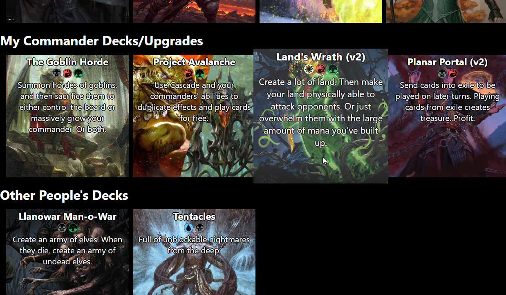
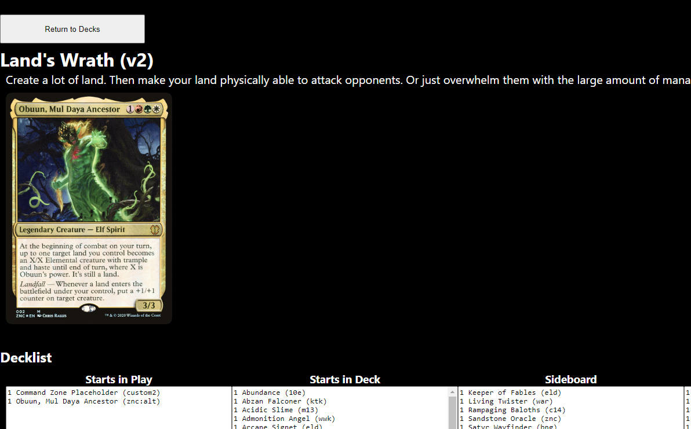

Important Note: I haven't worked on this project since maybe 2022, with no major changes since 2021. I'm uploading it now as part of an effort to catalogue and clean up some of my old projects, or at least save it for posterity. 

# Magic: the Gathering Decklist Display
My friends and I used to play a lot of Magic, especially using online services like Untap.io. Untap only allows free users to store 10 decks in-app, if you want to add more you have to either pay or delete some to make space. The obvious solution is to have a series of text files that can be pasted into Untap's "Import" feature as needed. 

But I wanted something fancier, and I wanted to impress my friends with my web dev skills. So I made an app to display a list of the decks I used, along with some pre-constructed beginner decks and (later) some of my friends' decks. Decks are split into categories, and display a title, brief description, and colour identity. There's a fun growth animation when you hover over them, because I felt like it. 

Clicking on a deck shows copy-able text fields that can be used to import into Untap. 

## What I might do in future
This entire app is a quick-and-dirty solution to a problem that doesn't really exist. But I might do some updates if I feel like it. 
1. Actual Database support. When I made this I just pasted everything into a huge JSON file, but adding a database and the ability to actually add/remove/edit decks might be a fun project. 
2. Image URL caching/saving. The individual deck pages show a display card for that deck - e.g. a commander, main planeswalker, etc. At the moment, the app uses the Scryfall API to look up information about the card, then discards everything but the card image URI, which it uses to display the card image. If you select the same deck three times, it makes three API calls. It would be much better to cache this somehow and avoid the excess calls. 